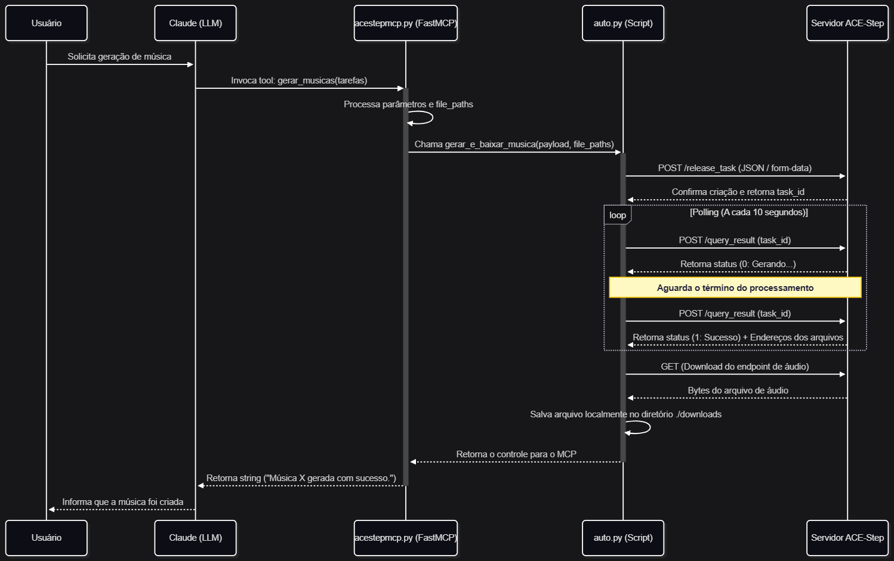

# Diagrama de sequência

# Caso de uso:
## Prompt do Claude

## Parâmetros da geração

## Músicas geradas
<table>
  <tr>
    <td>
      <video src="https://github.com/user-attachments/assets/b416aac4-4989-41ab-a17c-8f280020362c" controls width="130"></video>
    </td>
    <td>
      <video src="https://github.com/user-attachments/assets/20da787b-5a10-48ea-a80f-e48edad1eec4" controls width="130"></video>
    </td>
    <td>
      <video src="https://github.com/user-attachments/assets/b95d0122-7538-4c8d-84f5-9c839a819b05" controls width="130"></video>
    </td>
    <td>
      <video src="https://github.com/user-attachments/assets/5a063eb1-996d-4ee9-a76f-6dd499856709" controls width="130"></video>
    </td>
  </tr>
</table>

## Exemplo com letra
<video src="https://github.com/user-attachments/assets/1fe593dc-504a-4ce5-aefe-80bd3d2a4351" controls width="130"></video>

